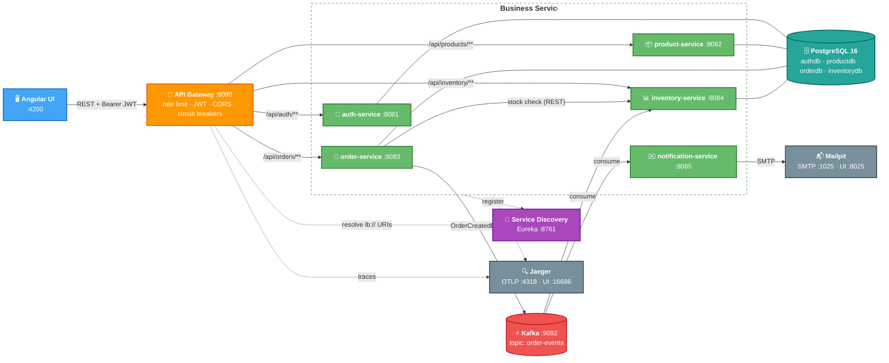
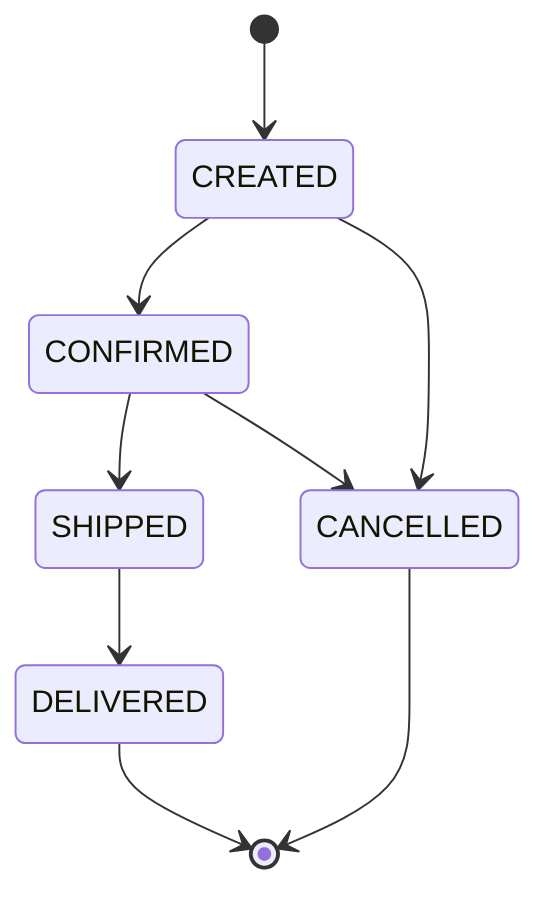
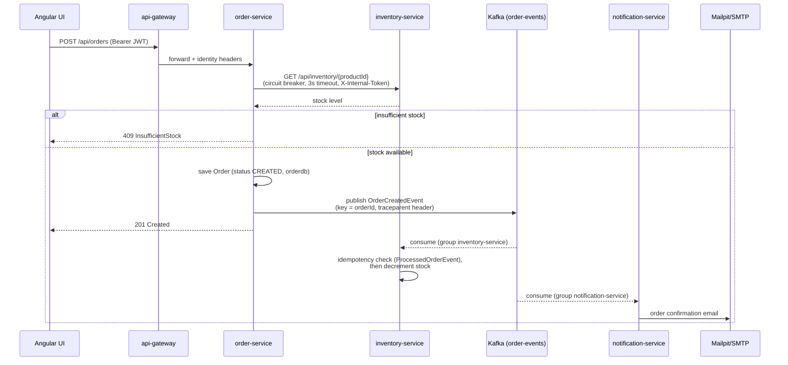

# Architecture

## Overview

Java microservices e-commerce platform. Seven Spring Boot services (single Maven reactor, parent POM `com.aditya.ecommerce:ecommerce-platform`) plus an Angular single-page UI. Each business service is independently deployable, owns its own PostgreSQL database, and exposes versionless REST under `/api/...`; services communicate synchronously over REST (via Eureka discovery) and asynchronously over Kafka.

**Tech stack**

| Layer | Technology |
|---|---|
| Language / runtime | Java 25 |
| Framework | Spring Boot 3.5.12, Spring Cloud 2025.0.0 |
| Edge | Spring Cloud Gateway (`api-gateway`) |
| Discovery | Netflix Eureka (`discovery-server`) |
| Messaging | Apache Kafka (KRaft, `apache/kafka:3.9.1`), Spring Kafka with JSON (de)serialization |
| Persistence | PostgreSQL 16 (one database per service), Spring Data JPA, Flyway migrations |
| Security | JJWT 0.12.6 (HS256 shared-secret JWTs), Spring Security |
| Resilience | Resilience4j circuit breakers + time limiters |
| Observability | Micrometer Tracing → OTLP → Jaeger; Spring Boot ECS structured logging (`json-logs` profile); Actuator |
| Frontend | Angular (standalone components + Material), served by nginx in containers |
| Testing | JUnit unit tests (Surefire, `*Test`), Testcontainers integration tests (Failsafe, `*IT`) |
| Packaging | Docker (one Dockerfile per service, root build context), Docker Compose, Kubernetes manifests in `k8s/` |

## System Topology



**Color key:** 🔵 client · 🟠 gateway · 🟢 business services · 🟣 discovery · 🔴 messaging · 🩵 databases · ⚪ mail & tracing

Notification-service is the only stateless business service (no database); inventory- and order-service are the only Kafka-connected services.

## Services

### API Gateway (`api-gateway`, port 8080)
Single entry point for all external traffic. Global filters run in order:

1. **`RateLimitingFilter`** (order -2) — in-memory fixed window, 60 requests/min per client IP, returns 429. Per-instance; would need a Redis-backed limiter if the gateway scaled horizontally.
2. **`JwtAuthenticationFilter`** (order -1) — validates the `Authorization: Bearer` JWT for every route except the open paths `/api/auth/register`, `/api/auth/login`, `/api/auth/validate`. On success it forwards the verified identity downstream as `X-Auth-Subject` (username) and `X-Auth-Roles` (comma-joined roles).
3. **`InternalTokenRelayFilter`** — stamps the shared `X-Internal-Token` secret on every proxied request so downstream services can prove traffic came through the gateway.

Routes (all `lb://` via Eureka, each wrapped in a Resilience4j circuit breaker falling back to `/fallback` → 503): `/api/auth/**` → auth-service, `/api/products/**` → product-service, `/api/orders/**` → order-service, `/api/inventory/**` → inventory-service. Circuit breakers open at 50% failures over a 10-call window for 10s; the time limiter (6s) sits above the HTTP client response timeout (5s). CORS allows `http://localhost:4200`.

### Discovery Server (`discovery-server`, port 8761)
Eureka registry. All services register on startup and the gateway/order-service resolve peers through it. Deliberately excluded from tracing (heartbeat noise).

### Auth Service (`auth-service`, port 8081, `authdb`)
Users, roles (`ROLE_CUSTOMER`, `ROLE_ADMIN`), BCrypt-hashed credentials, and JWT issuance/validation (HS256, `JWT_SECRET` shared with the gateway, 1h expiry).

| Endpoint | Access |
|---|---|
| `POST /api/auth/register` | public |
| `POST /api/auth/login` | public |
| `POST /api/auth/validate` | public |
| `GET /api/auth/users` | admin (`@PreAuthorize`, via `HeaderAuthenticationFilter`) |

### Product Service (`product-service`, port 8082, `productdb`)
Product catalog with JPA Specification-based search.

| Endpoint | Access |
|---|---|
| `GET /api/products`, `GET /api/products/{id}`, `GET /api/products/search?name&category&minPrice&maxPrice` | any authenticated user |
| `POST /api/products`, `PUT /api/products/{id}`, `DELETE /api/products/{id}` | admin only |

### Order Service (`order-service`, port 8083, `orderdb`)
Order lifecycle. On creation it synchronously checks stock against inventory-service (RestClient through Eureka, wrapped in its own Resilience4j circuit breaker `inventory`, 3s timeout), persists the order, then publishes `OrderCreatedEvent` to Kafka. Orders are always attributed to the gateway-verified `X-Auth-Subject`, never to a client-supplied username.

| Endpoint | Access |
|---|---|
| `POST /api/orders` | authenticated; owner taken from `X-Auth-Subject` |
| `GET /api/orders` | customer sees own orders; admin sees all |
| `GET /api/orders/{id}`, `PATCH /api/orders/{id}/status` | owner or admin |

Status transitions are validated server-side:



### Inventory Service (`inventory-service`, port 8084, `inventorydb`)
Stock per product. Serves synchronous availability reads and consumes `order-events` to reserve stock. Consumption is **idempotent**: processed order IDs are stored in a `ProcessedOrderEvent` table so duplicate deliveries are skipped. Insufficient stock on the async path is logged and dropped (no compensation flow yet).

| Endpoint | Access |
|---|---|
| `GET /api/inventory/{productId}` | any authenticated user (also used by order-service) |
| `PUT /api/inventory/{productId}/adjust?delta=` | admin only |

### Notification Service (`notification-service`, port 8085, stateless)
Consumes `order-events` and sends an order-confirmation notification via a **Strategy pattern**: `NotificationStrategy` implementations for EMAIL (JavaMail → Mailpit locally), SMS, and PUSH (the latter two are logging stubs); the active channel is selected by `NOTIFICATION_CHANNEL` (default EMAIL).

### Angular UI (`angular-ui`, port 4200)
Standalone-component Angular app with Material. Talks only to the gateway (`apiUrl: http://localhost:8080`); an HTTP interceptor attaches the JWT from `localStorage`, and an `authGuard` protects routes. Features: auth (login/register), home, product list, cart, checkout, order history. Served by nginx in the container (port 80, mapped to host 4200 to match the gateway's CORS origin).

## Key Flows

### Login and authenticated request

```mermaid
sequenceDiagram
    participant UI as Angular UI
    participant GW as api-gateway
    participant AUTH as auth-service
    participant SVC as any service

    UI->>GW: POST /api/auth/login (open path)
    GW->>AUTH: forward (+ X-Internal-Token)
    AUTH-->>UI: JWT (HS256, subject + roles, 1h)
    Note over UI: token stored in localStorage,<br/>attached by HTTP interceptor
    UI->>GW: GET /api/... + Authorization: Bearer
    GW->>GW: rate limit → validate JWT
    GW->>SVC: forward + X-Auth-Subject, X-Auth-Roles,<br/>X-Internal-Token
    SVC->>SVC: reject if X-Internal-Token missing/wrong;<br/>authorize on role/ownership headers
    SVC-->>UI: response
```

### Placing an order (sync check + async fan-out)



## Inter-Service Communication

| Pattern | Used for | Details |
|---|---|---|
| Synchronous REST | order → inventory stock check | `RestClient` resolving `http://inventory-service` via Eureka; Resilience4j circuit breaker + 3s time limiter; carries `X-Internal-Token` |
| Async messaging (Kafka) | order → inventory, notification | Single topic `order-events`, JSON payload `OrderCreatedEvent`, keyed by order ID; consumer groups `inventory-service` and `notification-service` |

Kafka consumer conventions (important — see the type-header pitfall):

- Each service defines its **own copy** of `OrderCreatedEvent` (DTO-per-service, shared schema). Consumers set `spring.json.use.type.headers: false` + `spring.json.value.default.type` so the producer's `__TypeId__` header (which names order-service's class) is ignored.
- Values are deserialized through `ErrorHandlingDeserializer` delegating to `JsonDeserializer`, so poison messages are logged and dropped instead of looping `poll()` forever.
- `observation-enabled: true` on both producer template and listeners propagates the `traceparent` header, keeping REST and Kafka hops in one distributed trace.

## Data & Persistence

- One PostgreSQL database per stateful service on a single server: `authdb`, `productdb`, `orderdb`, `inventorydb` (created by `docker/postgres-init.sql`). No shared tables; no JPA entities cross service boundaries (DTOs only).
- Schema is managed exclusively by **Flyway** (`ddl-auto: validate`, `baseline-on-migrate: true`).
- `inventorydb` additionally stores processed event IDs for idempotent consumption.
- Notification-service holds no state.

## Security

- **Edge authentication**: JWTs (HS256, secret shared between auth-service and gateway via `JWT_SECRET`) validated once at the gateway. The gateway forwards the verified identity as `X-Auth-Subject` / `X-Auth-Roles`; clients cannot spoof these because the gateway sets them after validation.
- **Service-to-service authentication**: shared secret `X-Internal-Token` stamped by the gateway (and by order-service on its inventory calls). Every service's `InternalTokenFilter` rejects requests without it, so services cannot be reached by bypassing the gateway. Production upgrade path: mTLS or a service mesh.
- **Authorization**: header-based in each service's `AccessControl` — admin-only catalog/stock mutations, owner-or-admin order access, `@PreAuthorize` in auth-service. Roles: `ROLE_CUSTOMER`, `ROLE_ADMIN`.
- **Rate limiting**: 60 req/min per client IP at the gateway, applied before JWT validation.
- **Secrets**: `JWT_SECRET`, `INTERNAL_TOKEN`, `DB_PASSWORD` have **no checked-in defaults** — services fail fast when missing. Local: `.env` (from `.env.example`); Kubernetes: `Secret` (from `k8s/02-secret.yaml.example`).

## Resilience

| Location | Mechanism |
|---|---|
| Gateway, all four routes | Circuit breaker per route (50% failure over 10-call window → open 10s), fallback `/fallback` → 503; 6s time limiter over a 5s HTTP client timeout |
| order-service → inventory-service | Circuit breaker `inventory`, 3s time limiter |
| Kafka consumers | `ErrorHandlingDeserializer` + `DefaultErrorHandler` (log-and-drop poison messages); idempotent processing in inventory-service |

## Observability

| Concern | Implementation |
|---|---|
| Distributed tracing | Micrometer Tracing → OTLP (`OTLP_TRACING_ENDPOINT`, default `http://localhost:4318/v1/traces`) → Jaeger UI at :16686; sampling `TRACING_SAMPLING_PROBABILITY` (default 1.0); traces span REST and Kafka hops; discovery-server excluded |
| Logging | SLF4J/Logback; console pattern includes `[app,traceId,spanId]`; `json-logs` Spring profile switches to ECS JSON (one document per line) for containers |
| Health & info | Actuator `health` + `info` exposed on every service |

## Deployment

- **Docker Compose** (`docker-compose.yml`): full stack — Postgres, Kafka (KRaft single node), Mailpit, Jaeger, all 7 services, Angular UI. Dockerfiles build from the repo root context. Host entry points: UI :4200, gateway :8080, Eureka :8761, Mailpit UI :8025, Jaeger UI :16686. Infra host ports are shifted (Postgres 15432, Kafka 29092) to coexist with locally installed instances; in-network services use `postgres:5432` / `kafka:9092`. Startup ordering via healthchecks (services wait for Postgres/Kafka/Eureka).
- **Kubernetes** (`k8s/`): numbered manifests — namespace, ConfigMap, Secret (example template), infra (Postgres, Kafka, Mailpit, Jaeger), then one Deployment/Service per app; `build-images.sh` builds the images. See `k8s/README.md`.
- **CI**: pipeline added on Day 14; a local pre-push hook (`.githooks`, enable with `git config core.hooksPath .githooks`) runs `mvn test` and the Angular test suite.

## Design Patterns in Use

| Pattern | Where |
|---|---|
| Gateway | `api-gateway` — single entry point for auth, rate limiting, CORS, resilience |
| Service Registry / client-side discovery | Eureka + `lb://` route URIs and `RestClient` service names |
| Chain of Responsibility | Ordered gateway global filters; Spring Security filter chains |
| Strategy | `NotificationStrategy` (EMAIL / SMS / PUSH) selected at runtime |
| Event-driven (Observer) | `OrderCreatedEvent` over Kafka decouples order from inventory/notification |
| Repository | Spring Data repositories in every stateful service |
| DTO | Request/response records per service; entities never cross boundaries |
| Circuit Breaker | Resilience4j at the gateway and on order → inventory calls |

## References

- [CLAUDE.md](CLAUDE.md) — build commands and contribution guide
- [CHANGELOG.md](CHANGELOG.md) — version history
- [k8s/README.md](k8s/README.md) — Kubernetes deployment guide
